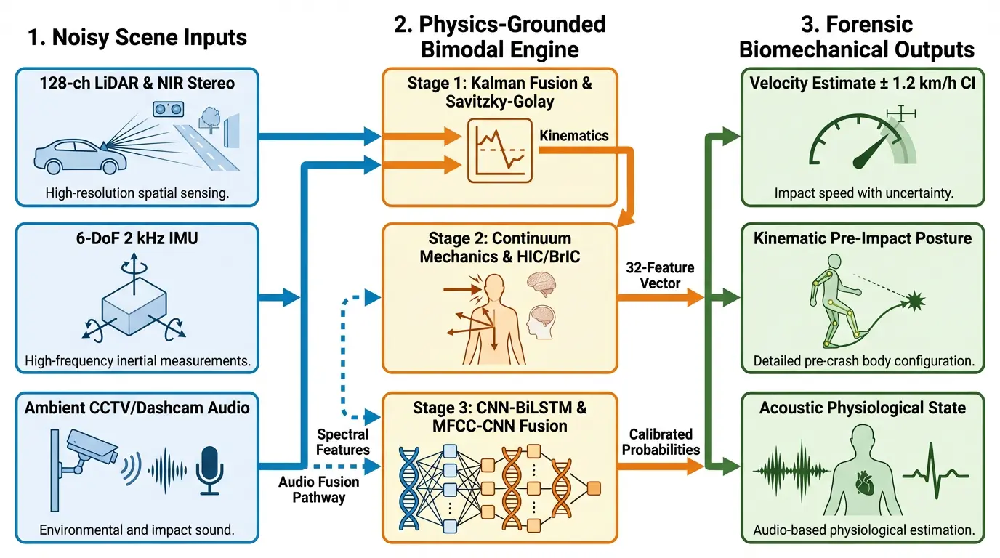
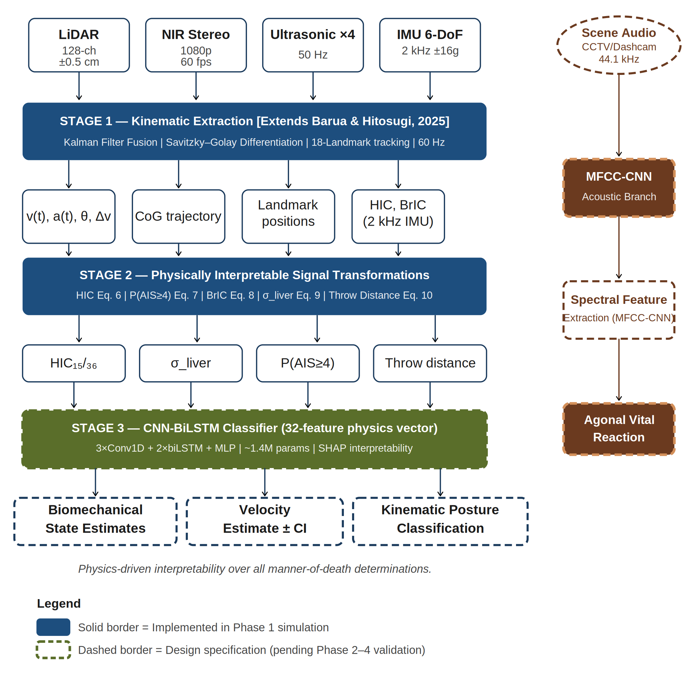
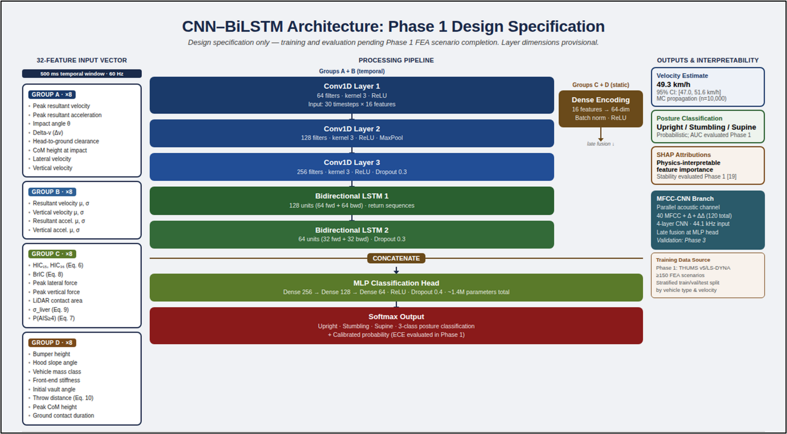
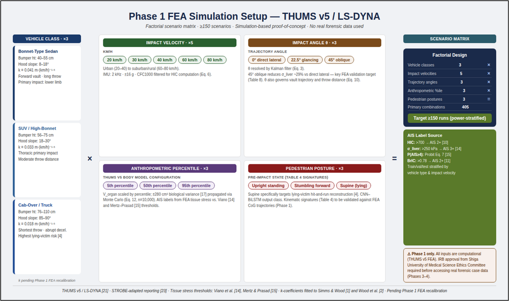
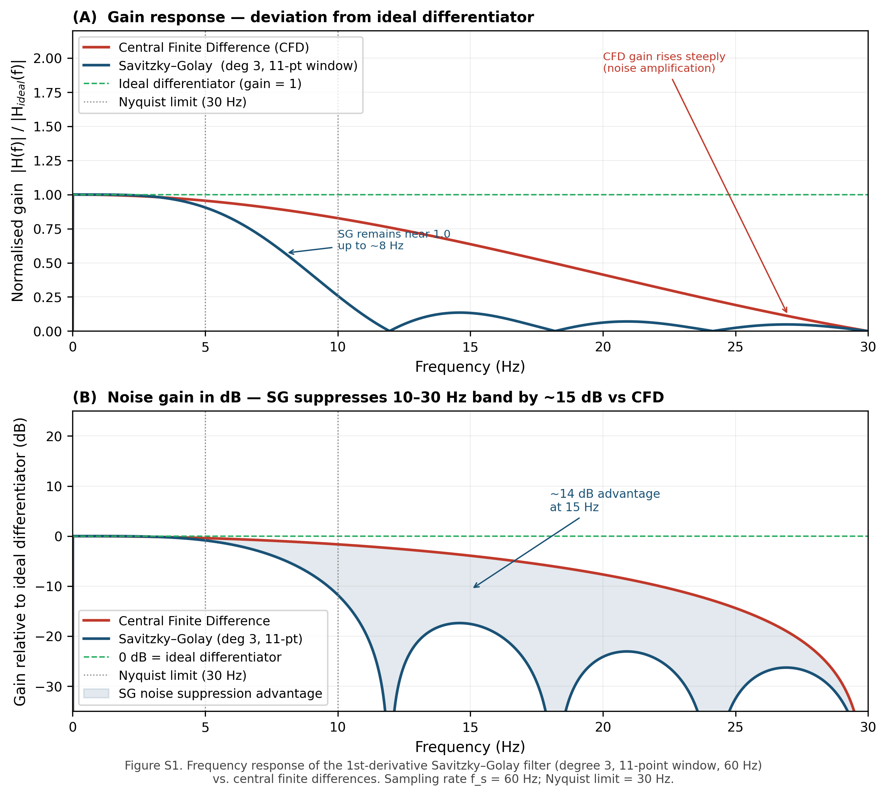
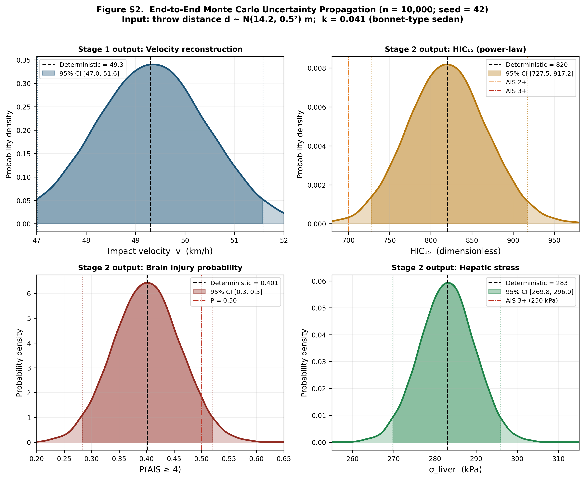

# Pedestrian Impact Kinematic Reconstruction Framework (Phase 1)

<p align="left">
  <a href="https://doi.org/10.5281/zenodo.20271138">
    
  </a>
  <a href="https://opensource.org/licenses/MIT">
    
  </a>
  
  
  
</p>

---

## 1. Overview

This repository provides the official Phase 1 technical implementation and numerical verification benchmarks for:

> **"A Physics-Grounded Multi-Modal Sensor Fusion Framework for Pedestrian Impact Kinematic Reconstruction Under Uncertainty: Phase 1 Design and Theoretical Evaluation"**  
> Barua, N.; Hitosugi, M. — *Sensors* (MDPI), 2026 (Under Review)

The framework treats forensic pedestrian–vehicle collision reconstruction as a **state-estimation problem**: recovering the dynamical trajectory of a physical system from incomplete, retrospective, noisy observables. It integrates a 128-channel LiDAR, 1080p NIR stereo cameras (60 fps), and a 6-DoF 2 kHz IMU via Kalman filtering and Savitzky–Golay differentiation, with end-to-end Monte Carlo uncertainty propagation (n = 10,000; seed = 42). A parallel MFCC-CNN acoustic branch is proposed for pre-impact physiological state classification from existing CCTV/dashcam recordings (design specification; experimental validation reserved for Phase 3).

**Highlights**
* Under simulated throw-distance uncertainty of ±0.5 m and activated vehicle-coefficient variance, velocity reconstruction uncertainty is **±2.03 km/h** (expanded Monte Carlo).
* A 10% noise spike in raw acceleration would theoretically amplify **HIC₁₅ by 26.9%** under the Wayne State power-law exponent, quantitatively justifying noise-optimal pre-filtering.
* Vehicle-class parameterisation is essential: a class-agnostic model applied to a cab-over truck scenario produces a theoretical velocity overestimation of **+36.1 km/h**.


### Graphical Abstract


*Proposed bimodal reconstruction architecture integrating high-resolution spatial sensing, high-frequency inertial measurements, and ambient scene audio.*
---


## 2. Abstract

Pedestrian–vehicle collisions produce a rich kinematic record that is entirely lost by the time a forensic investigation begins. Recovering this record constitutes a state-estimation problem. This paper presents a Phase 1 design for a multimodal sensor fusion and signal processing framework utilising 128-channel LiDAR, 1080p NIR stereo cameras, and a 2 kHz IMU, all fused via Kalman filtering and Savitzky–Golay polynomial differentiation. The framework is evaluated through Monte Carlo uncertainty propagation and sensitivity analysis applied to a constructed simulation scenario; no real clinical or forensic data are used in this Phase 1 report. Under simulated conditions with throw-distance measurement uncertainty of ±0.5 m and activated vehicle-coefficient variance, velocity reconstruction shows an estimated propagated uncertainty of ±2.03 km/h under expanded simulation conditions. Sensitivity analysis indicates that a 10% noise spike in acceleration would theoretically amplify injury metrics by 26.9%, providing quantitative justification for noise-optimal pre-filtering. The bimodal kinematic–acoustic architecture is proposed as a physically interpretable foundation for collision reconstruction; its experimental performance awaits Phase 2–4 validation. A five-phase validation roadmap is presented, progressing from FEA simulation to independent multi-site replication before any forensic deployment is proposed.

**Keywords:** multi-modal sensor fusion; Kalman filter; Savitzky–Golay differentiation; pedestrian–vehicle collision; uncertainty quantification; MFCC; CNN–BiLSTM; proof of concept; Phase 1 design

---

## 3. Framework Architecture

The system utilises a three-stage processing pipeline to recover kinematic states and map them to physically interpretable biomechanical quantities.

| Figure 1: System Architecture | Figure 2: CNN–BiLSTM Design Specification |
| :---: | :---: |
|  |  |
| *Bimodal reconstruction architecture — Stage 1 (Kalman fusion + SG differentiation) and Stage 2 (biomechanical signal transformations) implemented in simulation.* | *Phase 1 design specification — 32-feature input vector (Table S3), training and evaluation pending FEA completion.* |

| Figure 3: Five-Phase Validation Roadmap | Figure 4: Phase 1 FEA Simulation Setup |
| :---: | :---: |
|  |  |
| *Evidence accumulates sequentially; no forensic deployment is proposed until Phase 5 is complete.* | *THUMS v5 / LS-DYNA factorial scenario matrix — ≥150 primary runs (3 vehicles × 5 velocities × 3 angles × 3 anthropometries × 3 postures).* |

---

## 4. Core Contributions

| Contribution | Description |
|---|---|
| **1. Uncertainty-Aware Integration** | Physics-constrained multi-modal sensor fusion framework combining 128-channel LiDAR, NIR stereo, ultrasonic rangefinders, and a 2 kHz IMU via Kalman filtering to recover kinematic trajectories under Gaussian and non-Gaussian noise assumptions. |
| **2. Noise-Robust Signal Recovery** | Mathematical justification of Savitzky–Golay (degree-3, 11-point window, 60 Hz) differentiation over central finite differences and zero-phase Butterworth filters. End-to-end Monte Carlo uncertainty propagation (n = 10,000) provides quantitative bounds on theoretical reconstruction stability across all pipeline stages. |
| **3. Physics-Derived Feature Representation** | Structured 32-feature vector organised by signal-processing origin — kinematic state estimates (Group A), temporal waveform statistics (Group B), derived physical quantities (Group C), and environmental boundary conditions (Group D) — enabling physically interpretable downstream SHAP attribution. |
| **4. Bimodal Kinematic–Acoustic Architecture** | Proposed integration of an MFCC-CNN spectral branch (adapted from Rezaul et al., 2024) for pre-impact physiological state classification from ambient CCTV/dashcam audio. Provides a temporal physiological dimension unavailable from scene measurements or post-mortem examination alone. |

---

## 5. Repository Contents

| File | Description |
|---|---|
| `reproducibility_benchmark.py` | Main simulation script — reproduces all Phase 1 numerical results (Tables 4–8) |
| `requirements.txt` | Python dependencies |
| `CITATION.cff` | Machine-readable citation file |
| `LICENSE` | MIT Licence |
| `figure_1.png` | System architecture diagram (bimodal pipeline) |
| `figure_2.png` | CNN–BiLSTM design specification schematic |
| `figure_3.png` | Five-phase validation roadmap |
| `figure_4.png` | Phase 1 FEA simulation setup (THUMS v5 / LS-DYNA) |
| `figure_s1.png` | Supplementary Figure S1 — SG vs. CFD frequency response |
| `figure_s2.png` | Supplementary Figure S2 — Monte Carlo uncertainty propagation |
| `graphical_abstract.png` | Graphical abstract |

**Supplementary Material** (available via [Zenodo](https://doi.org/10.5281/zenodo.20096887)):
* **Table S1:** Phase 1 FEA Factorial Scenario Matrix (Target N ≥ 150)
* **Table S2:** Consolidated Uncertainty Budget — full stage-wise decomposition
* **Table S3:** 32-Feature CNN–BiLSTM Input Vector — complete hierarchical breakdown (Groups A–D)
* **Table S4:** Proposed Kinematic Fall-Mechanism Signatures — hypothesis-generating classification matrix for pre-impact posture and physiological state


---

## 6. Reproducibility Guide

### Requirements

```bash
pip install -r requirements.txt
```

- Python 3.8+
- `numpy`, `scipy`, `matplotlib`

### Execution

```bash
python reproducibility_benchmark.py
```

### Expected Numerical Outputs

All outputs are verified against the manuscript (Tables 4–5). The expanded Monte Carlo activates throw-distance uncertainty (Stage 1) together with vehicle-coefficient *k* and organ-volume *V*_organ variance (Stage 2).

| Output | Deterministic Value | MC Mean | SD | 95% CI |
|---|---|---|---|---|
| Impact velocity | 49.3 km/h | 49.3 km/h | ±2.03 km/h | [45.5, 53.5] |
| HIC₁₅ | 820 | 820 | ±84 | [654, 986] |
| σ_liver | 283 kPa | 283 kPa | ±6.7 kPa | [270, 296] |
| P(AIS ≥ 4, cranial) | ≈ 0.40 | — | — | — |

> **Note:** The larger velocity SD (±2.03 km/h) reflects the dominance of vehicle-class coefficient uncertainty (65.8% of total variance) versus throw-distance measurement error alone (32.9%). P(AIS ≥ 4) is a point estimate from the Mertz–Prasad lognormal probit model at HIC₁₅ = 820; a simulation-based CI is not reported in this Phase 1 proof-of-concept run.

---

## 7. Technical Benchmarks

| Figure S1: DSP Verification | Figure S2: Monte Carlo Uncertainty Propagation |
| :---: | :---: |
|  |  |
| *Savitzky–Golay noise suppression advantage over central finite differences — ~15 dB in the 10–30 Hz band.* | *End-to-end propagation from throw-distance measurement error through velocity, HIC₁₅, σ_liver, and P(AIS≥4); expanded simulation with vehicle-coefficient and organ-volume variance activated.* |

---

## 8. Monte Carlo Simulation Specification

As reported in manuscript Table 3 (n = 10,000; seed = 42):

| Parameter | Phase 1 Status | Distribution / Value | Pipeline Stage | Basis |
|---|---|---|---|---|
| Throw distance *d* | **Active** | N(14.2, 0.5²) m | Stage 1 | ±0.5 m tape-measurement uncertainty |
| Vehicle coefficient *k* | **Active** | N(0.041, σ²_k) | Stage 2 | From sedan CI [0.037, 0.045] |
| Organ volume *V*_organ | **Active** | N(1560, 280²) cm³ | Stage 2 | Geraghty et al. [17] |
| Vehicle class | Fixed | Sedan | Stage 2 | Sensitivity in Table 6 |
| LiDAR landmark | Fixed | ±0.5 cm uniform | Stage 1 | Hardware spec |
| IMU noise | Fixed | ±0.16 g RMS | Stage 1 | MEMS spec |
| Body mass | Fixed | 70 kg | Stage 2 | 50th percentile male |
| Sync drift | Fixed | 0 ms | Stage 3 | Ideal; bounds in Section 4 |
| Model exponent | Fixed | 1.5 | Stage 2 | First-order approximation |
| Covariance | Fixed | Diagonal | All | Zero correlation between inputs |
| *n* | — | 10,000 draws | — | — |
| Random seed | — | 42 | — | Computational reproducibility |

> **Active** = treated as a random variable in the current Phase 1 run. **Fixed** = deterministic boundary condition. Full multi-variable propagation with cross-covariance terms is a defined deliverable of Phase 1 FEA calibration.

**Stage-wise variance decomposition:**
* σ²_Stage1 ≈ 1.36 (km/h)² — throw-distance uncertainty — **32.9% of total**
* σ²_Stage2 ≈ 2.72 (km/h)² — vehicle-coefficient + organ-volume uncertainty — **65.8% of total**
* Cross-terms ≈ 0.05 (1.3%, diagonal covariance approximation)

---

## 9. Academic Status & Citation

This research is currently **under review** at *Sensors* (MDPI).

**BibTeX:**
```bibtex
@article{barua2026forensic,
  author    = {Barua, Nick and Hitosugi, Masahito},
  title     = {A Physics-Grounded Multi-Modal Sensor Fusion Framework for
               Pedestrian Impact Kinematic Reconstruction Under Uncertainty:
               Phase 1 Design and Theoretical Evaluation},
  journal   = {Sensors (Under-review)},
  publisher = {MDPI},
  year      = {2026},
  note      = {Under review},
  doi       = {10.5281/zenodo.https://doi.org/10.5281/zenodo.20271138}
}

---

## 10. Intellectual Property & Disclosures

- **Code Licence:** MIT — see `LICENSE`
- **Patent:** Aspects of this framework are covered under Japanese Patent Application **No. 2025-167440** (filed 3 October 2025, Japan Patent Office)
- **Coauthorship disclosure:** N.B. is a co-author of the MFCC-CNN architecture (Rezaul et al. 2024, Reference [6]) on which the acoustic branch of this framework is based; this overlap is disclosed in the interest of transparency

---

## 11. Validation Roadmap

This repository covers **Phase 1 only**. No forensic deployment is proposed until Phase 5 is complete.

| Phase | Setting | Target N | Primary Metrics | Status |
|---|---|---|---|---|
| 1 — Simulation & Algorithm | THUMS v5 / LS-DYNA | ≥150 scenarios | RMSE, AUC, ECE, SHAP stability | 🔄 In progress |
| 2 — Instrumented Tests | Crash dummy trials | ≥50 trials | Throw distance RMSE; sensitivity/specificity | ⏳ Pending |
| 3 — Real-World Data | CCTV/dashcam (IRB) | ≥30 cases | Acoustic SNR sensitivity; kinematic concordance | ⏳ Pending |
| 4 — Clinical Validation | IRB-approved cohort | ≥100 cases | AIS/ISS Pearson r; McNemar; ECE | ⏳ Pending |
| 5 — Deployment Readiness | Multi-site replication | ≥200 cases | Known error rate; admissibility checklist | ⏳ Pending |

---

## 12. Acknowledgments

Supported by the Department of Legal Medicine, Shiga University of Medical Science, Otsu, Shiga, Japan.

---

> **Important:** The present manuscript reports only theoretical and simulation-based framework behaviour under controlled assumptions and must not be interpreted as evidence of operational forensic accuracy. No casework use, clinical interpretation, or legal admissibility assessment is supported until Phase 5 of the validation roadmap has been fully completed and a multi-site known error rate formally established.

```bash
pip install -r requirements.txt
